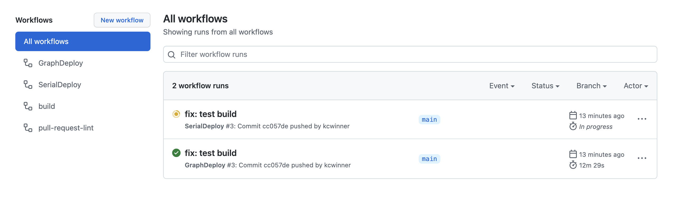
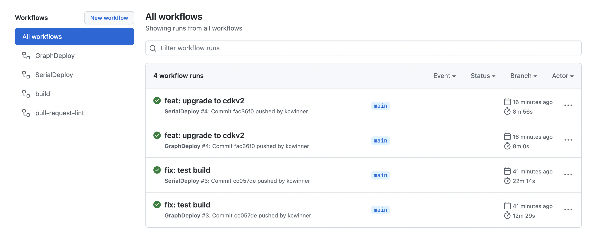

# CDK Day 2022 - Parallel CDK stack deploys with GitHub Actions and Projen

This was based on a blog post that can be found [here](https://www.stedi.com/blog/parallel-cdk-stack-deployments). Parallel deploys can speed up your times if you have several stacks to deploy at once with (or without) dependencies on each other. The magic number seems to be around 6+ stacks to see some real wins. There are some cases where parallel is slower for small changes due to action runner setup.

*Disclaimer* Faster does not necessarily mean cheaper. This method utilizes more concurrent running time and costs a bit more.

## Comparing the initial deploy times
You can see in the image that the parallel finishes while the serial is still running. The serial version was still deploying to demo when the parallel finished.

* [Serial](https://github.com/kcwinner/cdkday-2022/actions/runs/2391727687): The initial serial deploy took `22m14s` to get from build -> demo -> prod
* [Parallel](https://github.com/kcwinner/cdkday-2022/actions/runs/2391727686): The initial parallel deploy took `12m29s` to get from build -> demo -> prod



## Comparing the CDKv2 upgrade deploy times
With some smaller changes we don't make as huge gains with a lower number of stacks. However, in a larger application we see some better wins.

* [Serial](https://github.com/kcwinner/cdkday-2022/actions/runs/2391854817): The initial serial deploy took `8m56s` to get from build -> demo -> prod
* [Parallel](https://github.com/kcwinner/cdkday-2022/actions/runs/2391854815): The initial parallel deploy took `8m0s` to get from build -> demo -> prod



## Adding OIDC Provider

https://github.com/aws-actions/configure-aws-credentials#sample-iam-role-cloudformation-template

## Key files / functions

* [stackDeps.js](bin/stackDeps.js) - parses the `cdk.out/manifest.json` and returns our stacks
* [generateStackGraphs.js](bin/generateStackGraphs.js) - uses `stackDeps.js` and `cdk synth` to generate the `graph.json`
* [graph.json](generated/graph.json) - the generated graph from our `npx projen generate:stack-graphs` task
* [graphDeploy.js](.projen/workflows/graphDeploy.js) - custom projen deploy workflow that generates the `deploy.yml` for the project. We take the graph from `generated/graph.json` and create a workflow based on the dependencies.

## Run it yourself

```
# Generate the stack graphs first
npx projen generate:stack-graphs # custom task in .projenrc.js

# Then run projen default to create the workflow
npx projen
```
